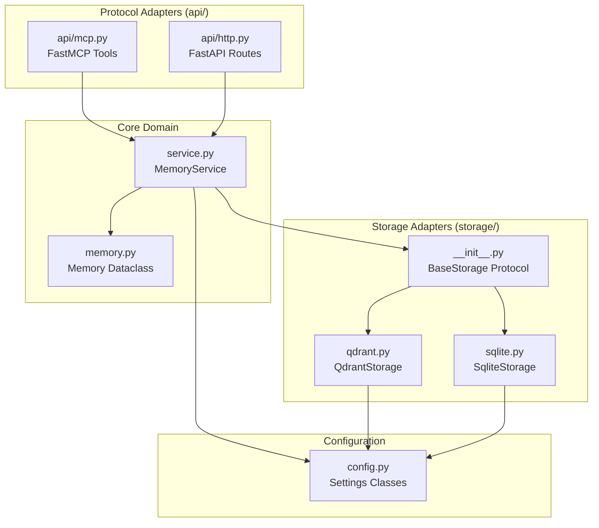

# Design Document: Codebase Remediation

## Overview

This design transforms a 34,233-line monolithic codebase into a ~2,000-line hexagonal architecture. The core principle: **service.py is the heart** - pure business logic that knows nothing about protocols or storage implementations.

## Steering Document Alignment

### Technical Standards (tech.md)
- Python 3.13+ with strict type checking (basedpyright)
- FastMCP for MCP protocol, FastAPI for HTTP (optional)
- pydantic-settings for configuration with SecretStr for secrets
- Qdrant for production, SQLite-vec for development
- e5-base-v2 embeddings (768-dim, no prefix complexity)

### Project Structure (structure.md)
```
src/mcp_memory_service/
├── __init__.py            # Version, quick imports
├── config.py              # 4 Settings classes (~200 lines)
├── memory.py              # Memory dataclass (~50 lines)
├── service.py             # MemoryService - THE CORE (~300 lines)
├── storage/
│   ├── __init__.py        # BaseStorage Protocol + factory (~100 lines)
│   ├── qdrant.py          # Production adapter (~600 lines)
│   └── sqlite.py          # Dev adapter (~400 lines)
├── api/
│   ├── __init__.py
│   ├── mcp.py             # FastMCP tools + TOON (~400 lines)
│   └── http.py            # FastAPI routes (~300 lines)
└── main.py                # Bootstrap, DI, lifecycle (~150 lines)
```

## Code Reuse Analysis

### Existing Components to Leverage
- **Qdrant storage logic**: Core upsert/search/delete from existing `storage/qdrant.py`
- **SQLite-vec storage**: Vector operations from existing `storage/sqlite.py`
- **Embedding generation**: `sentence-transformers` model loading from current implementation
- **TOON formatting**: Existing pipe-delimited format from MCP tools

### Integration Points
- **FastMCP**: Direct integration via `@mcp.tool()` decorators
- **Qdrant Client**: `qdrant-client` async operations
- **SQLite-vec**: `sqlite3` with `sqlite-vec` extension

## Architecture

The hexagonal (ports & adapters) architecture isolates business logic from infrastructure:



### Modular Design Principles
- **Single File Responsibility**: `service.py` = business logic only, `api/mcp.py` = protocol translation only
- **Component Isolation**: Storage backends are interchangeable via Protocol
- **Service Layer Separation**: API layer never touches storage directly
- **Utility Modularity**: TOON formatting lives in `api/mcp.py` (only consumer)

## Components and Interfaces

### Component 1: MemoryService (service.py)
- **Purpose:** Core business logic for memory operations
- **Interfaces:**
  ```python
  class MemoryService:
      async def store(self, content: str, tags: list[str] | None = None,
                      memory_type: str = "note", metadata: dict | None = None) -> Memory
      async def retrieve(self, query: str, limit: int = 10,
                         min_similarity: float = 0.6) -> list[tuple[Memory, float]]
      async def search_by_tag(self, tags: list[str], match_all: bool = False,
                              limit: int = 10) -> list[Memory]
      async def list_memories(self, limit: int = 10, offset: int = 0,
                              tag: str | None = None) -> list[Memory]
      async def delete(self, content_hash: str) -> bool
      async def health_check(self) -> dict
  ```
- **Dependencies:** BaseStorage (interface), EmbeddingModel
- **Reuses:** Embedding logic from current implementation

### Component 2: BaseStorage Protocol (storage/__init__.py)
- **Purpose:** Define storage contract for all backends
- **Interfaces:**
  ```python
  class BaseStorage(Protocol):
      async def upsert(self, memory: Memory, embedding: list[float]) -> None
      async def search(self, embedding: list[float], limit: int,
                       min_score: float) -> list[tuple[Memory, float]]
      async def search_by_tags(self, tags: list[str], match_all: bool,
                               limit: int) -> list[Memory]
      async def list(self, limit: int, offset: int, tag: str | None) -> list[Memory]
      async def delete(self, content_hash: str) -> bool
      async def count(self) -> int
      async def health(self) -> dict
  ```
- **Dependencies:** None (pure interface)
- **Reuses:** Contract patterns from existing storage implementations

### Component 3: QdrantStorage (storage/qdrant.py)
- **Purpose:** Production storage using Qdrant vector database
- **Interfaces:** Implements BaseStorage Protocol
- **Dependencies:** `qdrant-client`, QdrantSettings
- **Reuses:** Core Qdrant operations from existing implementation

### Component 4: SqliteStorage (storage/sqlite.py)
- **Purpose:** Development storage using SQLite with vector extension
- **Interfaces:** Implements BaseStorage Protocol
- **Dependencies:** `sqlite3`, `sqlite-vec`, SqliteSettings
- **Reuses:** SQLite vector operations from existing implementation

### Component 5: MCP Tools (api/mcp.py)
- **Purpose:** Expose MemoryService via MCP protocol
- **Interfaces:**
  ```python
  @mcp.tool()
  async def store_memory(content: str, tags: list[str] | None = None, ...) -> dict

  @mcp.tool()
  async def retrieve_memory(query: str, limit: int = 10, ...) -> str  # TOON format

  @mcp.tool()
  async def search_by_tag(tags: list[str], match_all: bool = False, ...) -> str

  @mcp.tool()
  async def list_memories(limit: int = 10, ...) -> str

  @mcp.tool()
  async def delete_memory(content_hash: str) -> dict

  @mcp.tool()
  async def check_database_health() -> dict
  ```
- **Dependencies:** MemoryService, FastMCP
- **Reuses:** TOON formatting from existing MCP implementation

### Component 6: HTTP API (api/http.py)
- **Purpose:** Optional REST API for web dashboard
- **Interfaces:** FastAPI routes mirroring MCP tools
- **Dependencies:** MemoryService, FastAPI
- **Reuses:** Route patterns from existing HTTP implementation

## Data Models

### Memory (memory.py)
```python
@dataclass
class Memory:
    content: str                          # The stored text
    content_hash: str                     # SHA256 hash for deduplication
    tags: list[str]                       # Categorization labels
    memory_type: str                      # "note" | "decision" | "task" | "reference"
    metadata: dict[str, Any] | None       # Additional structured data
    created_at: datetime                  # UTC timestamp
    updated_at: datetime                  # UTC timestamp
```

### Configuration Classes (config.py)
```python
class CoreSettings(BaseSettings):
    storage_backend: Literal["qdrant", "sqlite"] = "qdrant"
    embedding_model: str = "intfloat/e5-base-v2"
    embedding_dim: int = 768
    log_level: str = "INFO"

class QdrantSettings(BaseSettings):
    host: str = "localhost"
    port: int = 6333
    collection_name: str = "memories"
    api_key: SecretStr | None = None

class SqliteSettings(BaseSettings):
    db_path: Path = Path("memories.db")

class ApiSettings(BaseSettings):
    http_enabled: bool = False
    http_port: int = 8080
    cors_origins: list[str] = []  # Default empty, NOT ['*']
```

## Error Handling

### Error Scenarios
1. **Storage Connection Failure**
   - **Handling:** Raise `StorageConnectionError` with connection details
   - **User Impact:** MCP tool returns error with actionable message

2. **Embedding Model Load Failure**
   - **Handling:** Fail startup loudly with clear error message
   - **User Impact:** Service won't start, logs show exact issue

3. **Invalid Content Hash on Delete**
   - **Handling:** Return `{"success": false, "message": "Memory not found"}`
   - **User Impact:** Clear feedback, no silent failure

4. **Duplicate Content Storage**
   - **Handling:** Upsert (update existing memory with same hash)
   - **User Impact:** Memory updated, not duplicated

5. **Configuration Validation Failure**
   - **Handling:** pydantic raises ValidationError at startup
   - **User Impact:** Service won't start, exact missing/invalid config shown

## Testing Strategy

### Unit Testing
- **service.py**: Mock storage, test all business logic paths
- **config.py**: Test validation rules, defaults, SecretStr handling
- **memory.py**: Test dataclass creation, hash generation

### Integration Testing
- **storage/qdrant.py**: Test against real Qdrant (Docker in CI)
- **storage/sqlite.py**: Test with in-memory SQLite
- **api/mcp.py**: Test tool registration and TOON formatting

### End-to-End Testing
- Store → Retrieve → Delete flow via MCP
- Tag search with various AND/OR combinations
- Health check under normal and degraded conditions

## Deletion Strategy

### Phase 0: Security Fixes (Immediate)
- Delete `authlib`, `python-jose` from dependencies
- Fix anonymous access → read-only
- Fix CORS default → empty `[]`
- Delete mDNS discovery code

### Phase 1: Dead Code Removal
Files to delete entirely:
- `server.py`, `mcp_server.py`, `unified_server.py`
- `lm_studio_compat.py`
- `consolidation/`, `discovery/`, `sync/`, `ingestion/`
- `embeddings/onnx_*.py`
- `web/oauth/`

### Phase 2: Storage Consolidation
Files to delete:
- `storage/cloudflare.py`
- `storage/hybrid.py`
- `storage/http_client.py`

### Phase 3: Config Collapse
- Merge 15 config classes → 4 (Core, Qdrant, SQLite, Api)
- Delete all unused configuration options

## Migration Safety

- **Data Preservation**: All Qdrant data remains untouched
- **Rollback Path**: Keep old code in git history
- **Validation**: Run test suite after each deletion phase
- **Gradual Transition**: Phase-by-phase with verification
