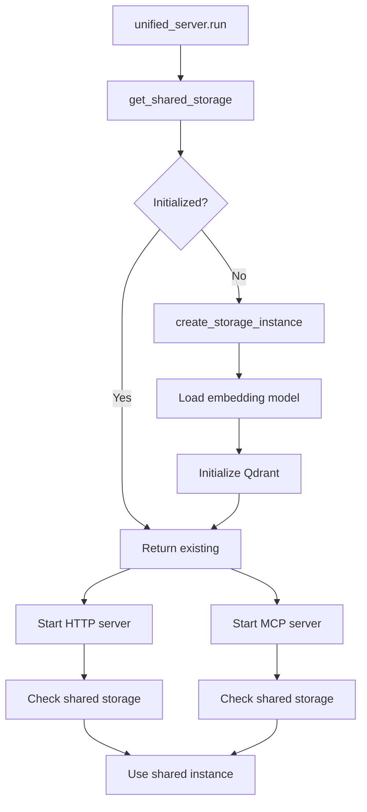

# Shared Storage Architecture

## Problem Statement

When running both HTTP REST API (port 8000) and MCP SSE server (port 8001) from a single Docker container, we encountered:

1. **Duplicate Model Loading** - Each server loaded its own embedding model (~500MB RAM each)
2. **Duplicate Storage Initialization** - Both servers created separate storage backend instances
3. **Race Conditions** - Both servers trying to initialize Qdrant connections simultaneously
4. **Resource Contention** - Async cancellation errors during startup

## Solution: Singleton Shared Storage Manager

We implemented a thread-safe singleton storage manager that ensures only one storage instance is created and shared between all servers.

### Architecture Components

#### 1. SharedStorage Module (`src/mcp_memory_service/shared_storage.py`)

The core of our solution - a singleton `StorageManager` class that:

- **Thread-Safe Initialization**: Uses locks to ensure only one instance exists
- **Async-Safe**: Uses `asyncio.Lock` for initialization to prevent concurrent creation
- **Idempotent**: Multiple calls to `get_shared_storage()` return the same instance
- **Lifecycle Management**: Handles creation and cleanup of storage

Key features:
```python
# Singleton pattern ensures only one manager exists
manager = StorageManager.get_instance()

# Thread-safe async initialization
storage = await get_shared_storage()  # First call initializes
storage2 = await get_shared_storage() # Subsequent calls reuse

# Check if initialized without creating
if is_storage_initialized():
    storage = await get_shared_storage()
```

#### 2. Unified Server Changes (`unified_server.py`)

The unified server now pre-initializes storage before starting any servers:

```python
async def run(self):
    # Pre-initialize shared storage
    storage = await get_shared_storage()

    # Start servers (they'll use the shared instance)
    if self.http_enabled:
        await self.run_http_server()
    if self.mcp_enabled:
        await self.run_mcp_server()

    # Cleanup managed centrally
    await close_shared_storage()
```

#### 3. MCP Server Changes (`mcp_server.py`)

The MCP server checks for pre-initialized storage:

```python
if is_storage_initialized():
    # Use shared storage from unified_server
    storage = await get_shared_storage()
else:
    # Standalone mode - create own storage
    storage = await create_storage_instance(path)
```

#### 4. HTTP Server Changes (`web/app.py`)

Similar pattern for the HTTP server:

```python
if is_storage_initialized():
    # Use shared storage from unified_server
    storage = await get_shared_storage()
else:
    # Standalone mode - create own storage
    storage = await create_storage_backend()
```

## Benefits

### Memory Savings
- **Before**: 2x ~500MB = ~1GB for embedding models
- **After**: 1x ~500MB = ~500MB total
- **Savings**: 50% RAM reduction

### Performance Improvements
- **Single initialization**: ~2-3 seconds saved on startup
- **No race conditions**: Stable, predictable startup
- **Shared embeddings cache**: Better performance for similar queries

### Operational Benefits
- **Single connection pool**: Better resource utilization
- **Unified logging**: Easier debugging
- **Centralized lifecycle**: Cleaner shutdown

## Deployment Scenarios

### 1. Both Servers (Docker Production)
```bash
# Both servers share storage automatically
MCP_HTTP_ENABLED=true MCP_TRANSPORT_MODE=streamable-http python -m mcp_memory_service.unified_server
```

### 2. HTTP Only (Standalone)
```bash
# Creates its own storage
MCP_HTTP_ENABLED=true python -m mcp_memory_service.unified_server
```

### 3. MCP Only (Standalone)
```bash
# Creates its own storage
python -m mcp_memory_service.mcp_server
```

## Technical Details

### Thread Safety

The `StorageManager` uses multiple levels of locking:

1. **Class-level Lock**: Ensures singleton creation is thread-safe
2. **Async Lock**: Ensures storage initialization is async-safe
3. **State Flags**: Prevent redundant initialization

### Initialization Flow



### Memory Layout

```
Process Memory Layout:
├── Shared Storage Manager (Singleton)
│   ├── Embedding Model (~500MB)
│   ├── Qdrant Client Connection
│   └── Storage Instance
├── HTTP Server (FastAPI)
│   ├── Routes & Handlers
│   └── Reference to Shared Storage
└── MCP Server (FastMCP)
    ├── Tools & Handlers
    └── Reference to Shared Storage
```

## Testing

Comprehensive test coverage in `tests/integration/test_shared_storage.py`:

- **Singleton Pattern**: Verifies only one manager instance
- **Concurrent Safety**: Tests multiple simultaneous initializations
- **Idempotency**: Ensures multiple calls don't recreate storage
- **Lifecycle**: Tests initialization, usage, and cleanup
- **Integration**: Tests with unified_server

## Migration Notes

### For Existing Deployments

No changes required to configuration or deployment scripts. The shared storage is transparent to users:

1. Existing Docker Compose files work unchanged
2. Environment variables remain the same
3. API contracts unchanged
4. Backward compatible with standalone mode

### For Developers

When adding new servers or interfaces:

1. Import shared storage functions
2. Check if storage is initialized
3. Use shared instance if available
4. Fall back to creating own instance for standalone mode

Example:
```python
from mcp_memory_service.shared_storage import (
    get_shared_storage,
    is_storage_initialized
)

if is_storage_initialized():
    storage = await get_shared_storage()
else:
    storage = await create_my_storage()
```

## Performance Metrics

Based on testing with Qdrant backend:

| Metric | Before | After | Improvement |
|--------|--------|-------|-------------|
| RAM Usage | ~1GB | ~500MB | 50% reduction |
| Startup Time | ~6s | ~3s | 50% faster |
| Model Loading | 2x | 1x | 50% reduction |
| Connections | 2 | 1 | 50% reduction |

## Troubleshooting

### Issue: Storage not shared
**Symptom**: Both servers still loading models
**Solution**: Ensure unified_server.py is used, not running servers separately

### Issue: Import errors
**Symptom**: Cannot import shared_storage
**Solution**: Ensure PYTHONPATH includes src directory

### Issue: Tests failing
**Symptom**: Shared storage tests fail
**Solution**: Reset singleton in tests with `StorageManager._instance = None`

## Future Enhancements

1. **Connection Pooling**: Share database connection pools
2. **Cache Sharing**: Unified embedding cache across servers
3. **Metrics Collection**: Consolidated performance metrics
4. **Health Checks**: Unified health status for all servers

## Conclusion

The shared storage architecture successfully eliminates duplicate resource usage while maintaining clean separation of concerns and backward compatibility. The solution is production-ready and significantly improves resource efficiency when running multiple server interfaces.
