# MCP Memory Service UI/UX Specification

This document defines the user experience goals, information architecture, user flows, and visual design specifications for MCP Memory Service's user interface. It serves as the foundation for visual design and frontend development, ensuring a cohesive and user-centered experience.

## Overall UX Goals & Principles

### Target User Personas

**👨‍💻 Alex the AI-Enhanced Developer**
- **Role:** Software developer using Claude Desktop + memory service
- **Context:** "I store code snippets, architectural decisions, and debugging solutions in my memory service"
- **Pain Points:** "I need to quickly find that solution I stored 3 weeks ago, and sometimes I need to clean up duplicate entries"
- **Goals:** Efficient storage/retrieval, bulk operations, advanced search
- **Tech Comfort:** High - comfortable with APIs but prefers GUI for memory management

**🧑‍💼 Jordan the Knowledge Worker**
- **Role:** Consultant, researcher, or analyst using AI assistants
- **Context:** "I accumulate insights from meetings, research findings, and client conversations"
- **Pain Points:** "I lose track of what I've stored, can't see patterns in my knowledge, and worry about sensitive info"
- **Goals:** Organization, categorization, privacy controls, analytics
- **Tech Comfort:** Medium - wants simple, intuitive interfaces

**👩‍🎓 Sam the AI Power User**
- **Role:** Early adopter experimenting with multiple AI tools
- **Context:** "I'm building personal knowledge systems and testing different memory approaches"
- **Pain Points:** "I need to export/import memories, understand what's actually stored, and optimize my AI interactions"
- **Goals:** Control, transparency, experimentation, integration
- **Tech Comfort:** High - wants both GUI and API access

**👨‍💼 Morgan the Team Lead**
- **Role:** Manager overseeing team using shared memory service
- **Context:** "Our team needs shared knowledge storage but individual privacy"
- **Pain Points:** "No visibility into team knowledge patterns, can't ensure compliance or manage storage costs"
- **Goals:** Administration, monitoring, compliance, resource management
- **Tech Comfort:** Medium-Low - needs dashboards and reports, not APIs

### Usability Goals

- **Immediate Value:** Users can find relevant memories within 10 seconds of accessing the dashboard
- **Efficient Management:** Power users can perform bulk operations (delete, tag, export) on multiple memories
- **Cognitive Load Reduction:** Interface reveals complexity progressively - simple by default, powerful when needed
- **Trust Building:** Users always understand what's stored, how it's organized, and can control their data
- **Workflow Integration:** Memory management integrates seamlessly into users' primary work without disruption

### Design Principles

1. **Memory-First Design** - Every interface decision prioritizes making memory management intuitive and natural
2. **Progressive Disclosure** - Start with simple operations, reveal advanced features gradually based on user needs
3. **Real-time Awareness** - Leverage SSE capabilities for live updates and immediate feedback on all operations
4. **Search-Centric Architecture** - Semantic search is prominent and powerful, supporting both casual and advanced queries
5. **Trust Through Transparency** - Users have complete visibility into what's stored, how it's organized, and full control over their data

### Change Log

| Date | Version | Description | Author |
|------|---------|-------------|--------|
| 2025-01-25 | 1.0 | Initial specification creation | Salih Ergüt |

## Information Architecture (IA)

### Site Map / Screen Inventory

```mermaid
graph TD
    A[Memory Dashboard] --> B[Search & Browse]
    A --> C[Memory Management]
    A --> D[Analytics & Insights]
    A --> E[Settings & Admin]

    B --> B1[Quick Search Bar]
    B --> B2[Advanced Search]
    B --> B3[Browse by Tags]
    B --> B4[Browse by Time]
    B --> B5[Recent Memories]

    C --> C1[Add New Memory]
    C --> C2[Edit Memory]
    C --> C3[Bulk Operations]
    C --> C4[Import/Export]
    C --> C5[Memory Details View]

    D --> D1[Storage Statistics]
    D --> D2[Usage Patterns]
    D --> D3[Tag Analytics]
    D --> D4[Search History]

    E --> E1[Storage Backend Config]
    E --> E2[API Access]
    E --> E3[Privacy Settings]
    E --> E4[System Health]
```

### Navigation Structure

**Primary Navigation:** Dashboard Home (overview with recent activity, quick search, key metrics), Search (primary entry point for finding memories with semantic + filters), Browse (organized views by tags, time, type for exploration), Manage (CRUD operations, bulk actions, import/export), Analytics (insights and statistics for power users/admins)

**Secondary Navigation:** Quick Actions Toolbar (Add memory, advanced search, bulk select), Context Menus (Right-click actions on memory items - edit, delete, duplicate, etc.), Filter Sidebar (Dynamic filtering within any view)

**Breadcrumb Strategy:** Path-based breadcrumbs (Home > Search Results > Memory Details), Context-aware display showing current filters and search terms, Action-oriented breadcrumbs with undo/redo capabilities for destructive actions